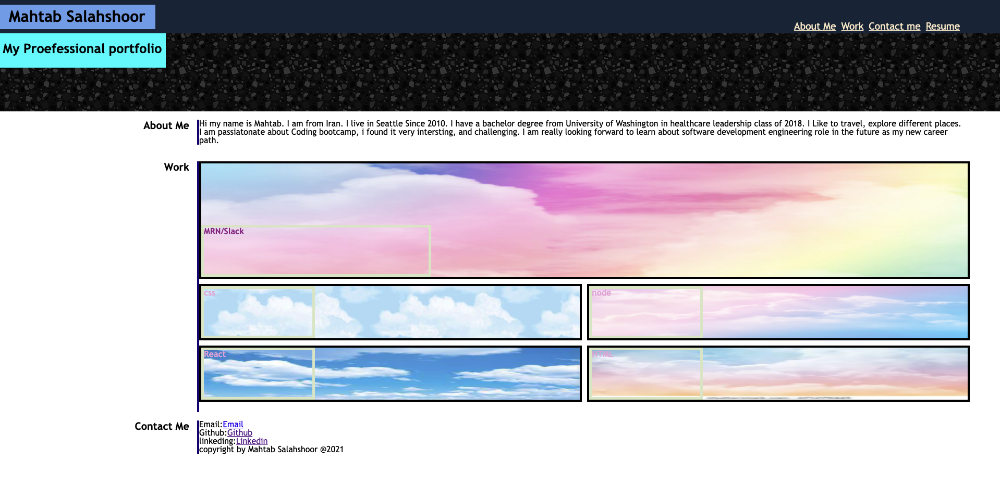

# portofolio:
Project-building-portfolio

#table of content:
[Project Name](#portfolio)
[Table of contents](#table-of-contents)
[General info](#general-info)
[Technology](#technology)
[Status](#status)
[Create By](#create-by)

#General info:
This portfolio is about how to contact me, short paragraphes about me, and my future work.

#Technology:
This following technology have been used:
HTML
CSS

#Status:
Completed

#created by
 Mahtab Salahshoor @2021

